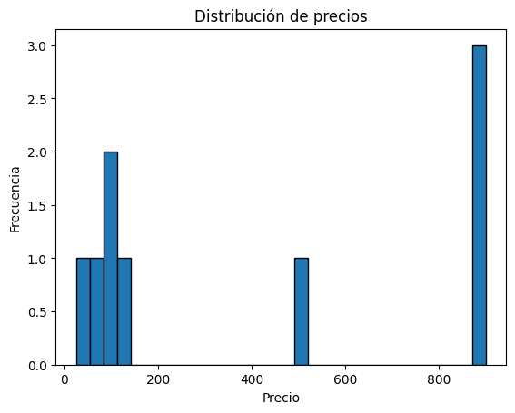

#Proyecto Python Sistema de Análisis de Datos de Comercio Electrónico

##Descripción del Proyecto
El objetivo es desarrollar un sistema que automáticamente extraiga datos de productos y precios de una tiendas en línea, almacene esos datos, y realice análisis para identificar tendencias, comparar precios y generar informes

##Requisitos

● Web Scraping 
● Manejo de Datos con Pandas 
● Funciones y Decoradores 
● Variables, Bucles y Condicionales 
● Manejo de Archivos 
● Módulos y Paquetes

#Ejecucion del programa

Para ejecutar el scraper hay que escribir en la terminal python -m src.analysis.analysis, lo que nos va a abrir una interfaz grafica con las opciones a ejecutar.

Esto nos genera un CSV en la carpeta "Processed" llamado "cleaned_products.csv"

#Graficos y estadisticas

Estadisticas

Productos ordenados

